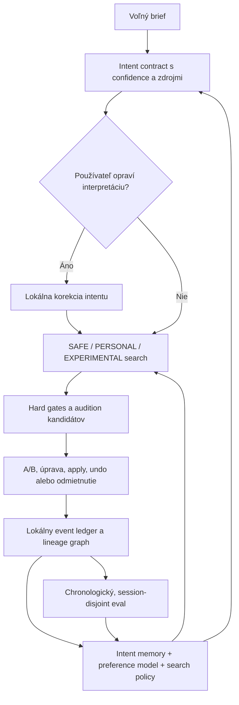

# KYX Recursive Learning — Implementation Plan

> Typ dokumentu: implementačný plán pre lokálne učenie z intentov, tvorby, výberov a revízií.
> Stav: implementácia pokračuje; Producer Memory, patternové audio učenie a prvý song-level feedback loop sú zapojené, 2026-10-07.
> Zámer: uzavrieť producentov cyklus od interpretácie briefu až po merateľné zlepšenie ďalšieho návrhu bez odosielania používateľských dát do cloudu.

### Implementačný progres — 2026-10-07

- **Základ fázy 0 hotový:** ADR 0026, validovaný event kontrakt, limity, lokálny import/export/delete API a evaluátor, ktorý drží celé prepojené skupiny podľa session, lineage a candidate hashov buď v tréningu, alebo v holdoute. Prekrývajúce sa časové skupiny sa vyradia. IndexedDB v15 pridáva oddelený bounded store pre resumovateľné pattern vetvy.
- **Zber prvých signálov zapojený:** potvrdené A/B voľby, ustálené edit páry aj opravy v brief kontrakte sa zapisujú ako eventy so session a content-hash lineage. Pri presnom zhode hrubého kontextu KYX ponúkne potvrdenú opravu ako voliteľný field chip; nikdy neprebije explicitné aktuálne zadanie. Pause je spoločné pre A/B, korekcie aj automatické edit učenie.
- **Workflow outcome signály zapojené:** apply, skutočné undo aplikovaného kandidáta a zrušenie slepého probe sa zaznamenajú samostatne; žiadny z nich sa nepoužije ako hlas za hudobný vkus.
- **Ovládanie hotové v základe:** export/import podporuje nový aj starý ledger pack, vetvy, anonymizované ★ patterny a kompaktné štýlové príklady. Osobný ONNX prior sa po importe môže znovu natrénovať zo ★ dát. Vymazanie DNA čistí eventy, style examples, ★ dôkazy, korekcie, osobné prior modely aj runtime style cache; projekty zostávajú nedotknuté.
- **Správa pamäte doplnená:** posledné eventy sa dajú prezrieť bez promptov či hashov kandidátov a jednotlivo zabudnúť. A/B dôkaz sa odstráni aj zo synchronného ranker ledgeru; exportovaný forget tombstone zabraňuje jeho návratu pri importe staršieho balíka.
- **Istota rankera sprísnená:** kontextovo vzdialené porovnania majú menšiu efektívnu váhu, osobný residual sa konzervatívnejšie sťahuje ku globálnemu rankingu a Intent panel ukazuje cold-start/slabý signál/kalibráciu/opakované dôkazy spolu s počtom relevantných volieb. Prahy sú pilotné, nie tvrdenie o štatistickej kalibrácii.
- **Ranker napojený na durable históriu:** pri štarte sa A/B a ustálené edit eventy načítajú z IndexedDB do synchronnej read-only cache; nové zápisy a mazania ju obnovujú. Starý `localStorage` ledger zostáva fallbackom a migračným zdrojom, ale jeho 128 položiek už nelimituje ranker po dokončení hydratácie.
- **Persistované generation vetvy doplnené:** samostatný IndexedDB store drží najviac 48 validovaných hudobných snapshotov. Intent Panel po reštarte ponúkne pokračovanie z ľubovoľného uloženého take-u, vetva zachová root/parent content hash a kontroluje kompatibilitu identifikátorov projektu, trackov a padov. Zabudnutie vetvy odstráni jej potomkov; event export/import prenáša aj snapshoty a tombstones.
- **A/B probe aktívnejšie vyberá neistú os:** pri rovnako čistých a takmer rovnako hodnotených kandidátoch uprednostní dvojicu, pri ktorej je ranker neistý a má málo efektívnych dôkazov. Dôvodový model sa pri jednom výbere napasuje najviac raz; skóre je query-value proxy, nie kalibrovaný Bayesian expected information gain. Blind side assignment, dismiss cooldown aj explicitný vote ostávajú zachované.
- **Už existuje:** SAFE / PERSONAL / EXPERIMENTAL candidate lanes, merateľné patternové varianty, kompletné generovanie skladby z jednotnej lane a technické audio kontroly celej skladby. Tieto generátory a UX netreba plánovať od nuly.
- **Verzované audio učenie rozšírené na `audio.v2`:** nový bounded post-render extractor ponecháva päť hodnôt `audio.v1` ako prefix a pridáva spektrálny centroid/rolloff/flatness, periodickosť a voliteľnú stereo šírku/koreláciu. V1 záznamy zostávajú validné; maska dostupnosti bráni tomu, aby sa mono alebo starý render považoval za stereo meranie. Nové A/B dôvody pokrývajú timbre, voicing a stereo. Raw PCM sa neukladá.
- **Song feedback loop zapojený:** celé skladby majú samostatný task kontext a bars-weighted symbolický snapshot; A/B, `neither` a `both` sa aktivujú až po dopočutí oboch celých renderov. Výslovné voľby nesú `audio.v2` súhrn vrátane stereo merania, ak ho render poskytuje.
- **Sekčný feedback loop zapojený:** A/B sa viaže na rovnakú sekciu/rolu, používa features.v2 + audio.v2, samostatný `section` task a completion guard pre oba samostatne vyrenderované patterny s FX. Song generovanie už používa ten istý task pri re-rankovaní sekčných kandidátov.
- **Song audio re-ranking zapojený:** po vyrenderovaní aspoň dvoch úplných lanes model znovu zoradí iba tieto lanes podľa globálneho section-quality baseline plus song-scoped symbolic/audio residualu; celkový osobný residual je ohraničený na 0.20. UI uvádza počet dôkazov a shrinkage weight; prvotný build tip zostáva symbolický, kým nie sú k dispozícii porovnateľné rendery.
- **Evaluácia rozdelená podľa tasku:** ten istý leakage-safe holdout teraz uvádza symbolic aj audio accuracy/lift samostatne pre `pattern`, `section` a `song`; spoločný split stále drží prepojené session/lineage/candidate skupiny pokope.
- **Audio kontrakty porovnateľné na tom istom holdoute:** evaluátor reportuje v1-prefix lift, plný v2 lift a ich paired rozdiel po úlohách; v2 porovnanie používa len holdout páry, ktoré majú obe strany `audio.v2`.
- **Skutočné online skóre sa zachytáva pri A/B spätnej väzbe:** snapshot kandidáta môže uložiť efektívne osobné skóre použité tesne pred uložením voľby. Evaluátor samostatne uvádza jeho holdout accuracy/lift podľa tasku oproti globálnemu skóre; spätne pretrénované skóre ostáva oddeleným diagnostickým pohľadom. Staré záznamy bez zachyteného skóre sa do online metrík nezapočítajú.
- **Blind global-vs-personal pilot je instrumentovaný:** opt-in sa zapína pred ďalším GENERATE; oba rankery musia mať jednoznačný, odlišný top kandidát z toho istého banku a rovnakej global-score verzie. UI náhodne pridelí A/B kryptografickou náhodou a schová zoradený bank aj zdrojové označenia pred voľbou aj po nej. Pilotný event ostáva lokálny a evaluator reportuje samostatný captured-score lift. Pilot ešte nikto nevykonal.
- **Probe výber spresnený:** kandidátová otázka zohľadňuje rankerom odhadnutú pairwise entropiu aj effective evidence shrinkage popri izolácii jednej meranej osi. Je to query-value proxy, nie kalibrovaný Bayesian expected information gain.
- **Song dramaturgia doplnená:** ADR 0032 a `song-dramaturgy.v1` pridávajú fixný 33-rozmerný opis formy, poradia a dĺžok sekcií, energetického/density vývoja, prechodov, kontrastu a sekčných melodických/harmonických meraní. Porovnanie celej skladby si môže zvoliť konkrétny aspekt; jeho voľby trénujú oddelený shrinkage-weighted ranker a dramaturgické accuracy/lift sa vykazuje samostatne na rovnakom holdoute. Featury sa ukladajú iba ako normalizované čísla, bez PCM.
- **Ešte otvorené:** opt-in blind pilot s reálnymi používateľmi, kalibrácia prahov confidence/probe-value a grouped holdout validácia prínosu dramaturgických featur. `audio.v2` meria akustické proxy, nie identitu nástroja či presetu; syntetické či existujúce eventy samy osebe nedokazujú hudobnú kvalitu.
- Legacy `localStorage` ledger zostáva migračným zdrojom a fallbackom. Po dokončení IndexedDB hydratácie už jeho kapacita neurčuje množstvo dôkazov dostupných rankeru.

## 1. Cieľ a hranice

„100 % recursive learning“ neznamená model, ktorý vždy uhádne vkus. Vkus je nejednoznačný a mení sa. Cieľom je **úplná, kontrolovateľná slučka**: KYX ukáže, ako pochopil brief, dovolí opravu, vytvorí platné varianty, zaznamená výslovnú spätnú väzbu, zapamätá si jej kontext a vie preukázať, či ďalšie návrhy používateľovi sedia lepšie.

Osobný vkus a plnenie zadania musia zostať oddelené. Hard constraints, `preserve` a brief gates majú prednosť pred preferenciami. Osobná pamäť môže meniť mäkké smerovanie a poradie platných kandidátov, nikdy nesmie potichu meniť používateľov cieľ alebo projekt.

Zámerne neplánujeme začať ďalším veľkým ONNX modelom. Dnešný osobný model je malý deterministický pairwise model; pri malom počte lokálnych volieb je dôležitejšia kvalita udalostí, kontextu, generovaných alternatív a evaluácie než väčšia sieť.

## 2. Základ, ktorý už existuje

- `src/intent/preference-ledger.ts` ukladá lokálne explicitné A/B rozhodnutia a korekčné páry; voliteľne aj verzované audio.v1/audio.v2 súhrny z renderu, nikdy raw audio.
- `src/intent/preferenceContextForIntent()` vytvára hrubý kontext zo žánru, produkčného profilu, úlohy a cieľových rolí.
- `src/intent/personal-ranker.ts` fituje deterministický pairwise logistický model nad hudobnými vlastnosťami a aplikuje ohraničený residual po globálnom výbere.
- `src/intent/iteration.ts`, `src/intent/session-context.ts` a `src/persistence/ProducerLineageRepository.ts` podporujú follow-upy aj obnovenie uložených vetiev po reštarte.
- `src/intent/preference-evaluation.ts` a `npm run producer-dna:evaluate` poskytujú offline evaluátor s finálnym chronologickým holdoutom celých prepojených skupín podľa session, lineage a kandidátskych hashov. Dôkaz z pilotu zatiaľ neexistuje.
- Pattern featury pokrývajú symbolickú štruktúru; `audio.v2` pridáva obmedzené akustické súhrny timbru, periodickosti a stereo obrazu pri zachovaní v1 záznamov. Osobné učenie section/song dramaturgie a mixu stále vyžaduje širšie signály aj holdout dôkaz. Slovníkové učenie fráz ostáva samostatné opt-in mimo tejto pamäte.

Plán rozširuje tieto cesty. Nezavádza druhý paralelný generátor ani nový zdroj pravdy v Reacte.

## 3. Cieľová slučka

Každá šípka musí mať viditeľný pôvod a verzované pravidlá. Používateľ môže učenie pozastaviť, prezrieť si pamäť, exportovať ju alebo vymazať.

## 4. Implementačné fázy

### Fáza 0 — Kontrakty, súkromie a eval protokol

**Stav:** implementované v ADR 0026 a `src/intent/producer-memory-*`; eventový evaluátor používa finálny holdout celých prepojených skupín. Zostáva nazbierať nezávislé pilotné dáta.

**Prečo prvá:** bez stabilného záznamu nevieme rozlíšiť, čo používateľ opravil, čo preferoval a čo iba použil.

**Práca:**

1. Otvoriť ADR pre lokálnu Producer Memory: úložisko, migrácie, limity, export/delete a pravidlá signálov.
2. Definovať verzovaný `ProducerMemoryEvent` s typmi `intent-correction`, `pairwise-choice`, `settled-edit`, `apply`, `undo`, `dismiss` a `forget`.
3. Oddeliť `intent compliance`, `personal taste` a `workflow outcome`; neskladať ich do jedného nepriehľadného skóre.
4. Rozšíriť evaluáciu o session a lineage grouping ešte pred tým, než nové udalosti začnú slúžiť ako tréningové dáta.

**Súkromie:**

- Predvolene ukladať iba lokálne normalizované polia, kontextové štítky, content hashe, featury, rodičovské väzby a explicitné rozhodnutia.
- Neukladať raw audio, celý prompt, názov projektu ani súborovú cestu do Producer DNA.
- Personalizovaný slovník používateľových fráz potrebuje samostatné opt-in. Pri zapnutí ukladať iba používateľom potvrdený krátky úsek frázy a jej opravené intent pole; umožniť zobrazenie, úpravu a zmazanie každej položky.
- Ledger má zostať oddelený od `ProjectDocument`; učenie ani reset DNA nemení projekt.

**Hotovo, keď:** event schema je verzovaná a validovaná; invalid/mix verzií sa bezpečne odmietne alebo migruje; export/import/delete funguje; eval split blokuje únik candidate hashov, session aj lineage medzi train a holdout.

### Fáza 1 — KYX sa učí, ako používateľ opravuje intent

**Stav:** základ funguje: opraviteľný brief, potvrdené field/value korekcie, lokálna pamäť a návrhy s prednosťou aktuálneho zadania. Neukladá sa raw fráza; samostatný opt-in slovník je mimo dokončeného základu.

**Súčasný limit:** potvrdené štruktúrované opravy sa už ukladajú a môžu sa ponúknuť v podobnom kontexte; dlhodobé učenie raw fráz nie je zapnuté a vyžaduje samostatný opt-in.

**Práca:**

1. Pred generovaním zobraziť intent contract s hodnotami, confidence a pôvodom: explicitná fráza, parserový odhad alebo projektový default.
2. Umožniť opraviť konkrétne pole bez prepisovania promptu: napr. `density 0.45 → 0.70`, `mood dark → tense`, `target drums → lead`.
3. Zaznamenať opravu ako kontrast `predikcia → potvrdená hodnota` s kontextom, model/parser verziou a časom. Oprava nesmie spätne prepisovať originálny brief.
4. Začať konzervatívnym lokálnym correction memory (normalizované field/value páry a schválené aliasy), nie generatívnym fine-tuningom z niekoľkých príkladov.
5. Ak sa má učiť význam konkrétnych slov, vyžiadať opt-in na krátky úsek frázy. Bez neho sa učí iba štruktúrovaná korekcia, nie raw prompt.
6. Pri konflikte medzi novou opravou a starou pamäťou ukázať konflikt a uprednostniť aktuálny intent.

**Hotovo, keď:** používateľ vie rozlíšiť a opraviť neistý výklad; correction memory pomáha pri ďalšom podobnom intente; systém vie vysvetliť, z ktorej potvrdenej opravy vychádza; explicitný aktuálny pokyn vždy prebijе naučený default.

**Pravdepodobné oblasti kódu:** `src/intent/brief-contract.ts`, `src/intent/text-parser.ts`, `src/intent/normalize.ts`, `src/intent/producer-session.ts`, `src/ui/IntentPanel.tsx`; nové verziované typy a repository podľa ADR.

### Fáza 2 — Trvalá história rodičov a vetiev

**Stav:** IndexedDB lineage store a UI na obnovenie/zabudnutie vetiev už existujú. Nasledujúca práca je validácia používania a hranových prípadov, nie návrh nového lineage systému.

**Súčasný limit:** bounded graf vetiev sa ukladá a obnovuje, no ostáva potrebné overiť UX pri väčšom počte vetiev, retention a kompatibilitu po zásadných zmenách projektu.

**Práca:**

1. Zaviesť lokálny `ProducerLineageNode`: `nodeId`, `parentContentHash`, `rootContentHash`, intent delta, target/preserve scope, seed a verzie generátora/rankerov.
2. Pripájať k node udalosti audition, A/B, edit, apply, undo, reject a návrat k predchádzajúcej vetve. Samotné prehratie alebo `USE` nie je hlas za vkus.
3. Umožniť pokračovať z ľubovoľného rodiča, nie iba z poslednej generácie. Nová vetva nikdy neprepisuje rodiča.
4. Uložiť len potrebný snapshot/patch a UUID-free hash; zabezpečiť limit veľkosti, retention, export a mazanie.
5. Udržať hranicu: projekt menia iba existujúce commands s undo/redo; lineage je pamäť návrhov, nie druhý projektový model.

**Hotovo, keď:** reštart prehliadača nestratí zvolené vetvy; používateľ vie otvoriť rodiča a pokračovať z neho; stale projekt sa stále odmietne; vymazanie pamäte odstráni väzby bez zmeny projektu.

**Pravdepodobné oblasti kódu:** `src/intent/session-context.ts`, `src/intent/iteration.ts`, `src/intent/producer-session.ts`, nové `src/persistence/producer-memory/` repository a cielené UI v `IntentPanel`.

### Fáza 3 — Kontextové Producer DNA s neistotou

**Stav:** existuje deterministický reason-scoped pairwise ranker, hierarchická podobnosť hrubého kontextu, shrinkage, evidence stavy a vypnutie učenia. Prahy sú konzervatívne implementačné hodnoty; pilot ich ešte nekalibroval.

**Súčasný limit:** kontext je užitočný, no hrubý; dve porovnania môžu zapnúť model skôr, než má dosť dôkazov na stabilný osobný záver.

**Práca:**

1. Rozšíriť kontext hierarchicky: globálny používateľský prior → žáner → produkčný profil → task (`pattern/section/song`) → cieľová rola. Mood/energy/BPM používať ako kontext alebo mäkkú podobnosť, nie rigidnú partition, ktorá rozbije malé vzorky.
2. Zdieľať dôkazy medzi blízkymi kontextmi s explicitným shrinkage/confidence; neprelievať ich ako rovnako silné hlasovanie.
3. V UI zobrazovať `cold start / slabý signál / stabilnejší signál`, počet relevantných porovnaní a kontext, v ktorom sa použije.
4. Zachovať súčasný deterministický logistický model na prvý pilot. Zmeniť ho až vtedy, keď held-out dáta ukážu konkrétny problém; neistotu a minimálne množstvo dôkazov vyriešiť pred zväčšením modelu.
5. Rozlišovať signály: A/B winner = smerový vkus; `neither` = zlyhanie dvojice/briefu; `both` = prijateľnosť oboch; edit je smerový signál len po stabilizácii a nesmie sa zameniť s náhodným experimentom.

**Hotovo, keď:** jeden všeobecný signál pomôže pri cold-start, ale silné lokálne voľby ho postupne prebijú; každý personal residual má confidence a pevný strop; vypnuté/nezrelé DNA dá rovnaké poradie ako globálny selector.

**Pravdepodobné oblasti kódu:** `src/intent/preference-ledger-core.ts`, `src/intent/preference-ledger.ts`, `src/intent/personal-ranker.ts`, `src/ai/ranking/rank-candidates.ts` a UI `ProducerDnaCompare`.

### Fáza 4 — Aktívne učenie a personalizované generovanie

**Stav:** SAFE / PERSONAL / EXPERIMENTAL lanes, ich vysvetlenia, blind probes a dismiss/pause pravidlá sú už zapojené. Probe picker teraz kombinuje merateľnú izoláciu osi s predictive entropy osobného modelu a shrinkage podľa evidence; numerická hodnota je stále heuristický proxy.

**Súčasný limit:** re-ranking môže zmeniť poradie len kandidátov, ktoré vznikli; malé mäkké search nudges nevedia samy vytvoriť úplne nový hudobný smer.

**Práca:**

1. Predložiť A/B probe s nízkym confoundingom, vysokou neistotou osobného modelu a nízkym počtom dôkazov na danej osi. Súčasná entropia/shrinkage aproximácia sa musí v pilote kalibrovať a nemá sa označovať za formálny expected information gain.
2. Pýtať sa iba pri vhodnej chvíli; obmedziť frekvenciu, rešpektovať dismiss/pause a nepýtať sa na rozdiel, ktorý používateľ nevie počuť.
3. Generovať reálne odlišné rodiny: SAFE drží brief; PERSONAL skúša potvrdenú preferenciu; EXPERIMENTAL testuje jednu neistú os. Všetky kandidáty prejdú rovnakými hard gates a kontrolou preserve.
4. Nahradiť neoverené marketingové označenie experimentu vysvetlením konkrétnej zmeny: napr. „viac offbeat kickov“, nie iba „osobný take“.
5. Zachovať deterministický seed + policy version, aby sa kandidát dal reprodukovať a vysvetliť.

**Hotovo, keď:** kandidátske rodiny sa odlišujú merateľne aj v blind posluchu; PERSONAL je lepší než SAFE až po dostatočnom signáli; pri nízkej istote sa nespráva sebavedomejšie než cold-start.

**Pravdepodobné oblasti kódu:** `src/intent/candidate-search.ts`, `src/intent/candidate-bank.ts`, `src/intent/providers/local.ts`, `src/intent/providers/symbolic.ts`, `src/intent/taste-probe.ts`.

### Fáza 5 — Zvuk, sekcie a celé skladby

**Stav:** patternové audio ranking, sekčné A/B voľby a song-level A/B voľby majú oddelené task kontexty. Song `song-dramaturgy.v1` sumarizuje formu a vývoj sekcií; výslovná voľba aspektu učí samostatný ranker pre celkový dojem, vývoj, prechody, kontrast alebo harmóniu. Sound/mix voľby ostávajú v audio rankeri. Build odporúčanie môže použiť symbolické song/form evidence; rendered song ranking čaká na aspoň dve kompletné audio lanes.

**Súčasný limit:** section audition je izolovaný úplný pattern s jeho scoped FX; neobsahuje susedné prechody ani automatizáciu aranžmánu. Song re-ranking pracuje iba s lanes, ktoré už používateľ vyrenderoval, a nevyvoláva skryté drahé rendery. `song-dramaturgy.v1` je pevný súhrnný kontrakt, nie naučený hudobný embedding; jeho užitočnosť ešte musí potvrdiť grouped holdout a blind posluch.

**Práca:**

1. Udržať section/song adaptery oddelené a v held-out evaluátore reportovať ich oddelene; section audition zostať explicitne označený ako izolovaný pattern + FX.
2. **Implementované:** pridať samostatný `song-dramaturgy.v1` s poradiami/dĺžkami sekcií, rolami, energetickým oblúkom, hustotou/komplexitou, obmenou nástrojov, typmi a silou prechodov, kontrastom patternov a agregovanými melodickými/harmonickými featurami. Kontrakt je aditívny voči patternovým vektorom; staršie voľby zostávajú platné, ale bez song vektora tento model netrénujú.
3. **Implementované:** umožniť označiť song A/B dôkaz aspektom, ktorý sa hodnotí. Oddelený ranker používa reason-scoped pairwise príklady, kontextovú váhu, shrinkage a tvrdý residual limit; sound/mix aspekty netrénujú dramaturgický model.
4. Audio featury počítať cez existujúce offline/audio worker cesty; nikdy v audio callbacku. Raw audio do Producer DNA ledgeru neukladať.
5. Dovoliť používateľovi zvoliť, či hodnotí groove, sound, mix, harmóniu, sekčný vývoj alebo celkový dojem.

**Hotovo, keď:** vypnutá featura nemá vplyv na generation; live/offline preview zostane deterministický; patternové dáta sa nikdy potichu nepreinterpretujú ako section/song dôkaz; song audio residual sa použije len na úplných vyrenderovaných lanes s audio dôkazmi v song kontexte.

### Fáza 6 — Pilot, evaluácia a postupné zapnutie

**Stav:** evaluátor, bezpečný holdout, metrika zachyteného online skóre aj opt-in blind porovnávací workflow sú implementované. Zostáva nazbierať pilotné dáta a získať dôkaz pozitívneho liftu. Search policy preto zostáva konzervatívna.

**Práca:**

1. **Implementované:** zaznamenávať globálne skóre/verziu aj efektívne skóre pred voľbou a reportovať captured-score accuracy/lift vedľa bezpečne prepočítaného modelu. Pilot musí nazbierať dosť nových záznamov s týmto poľom.
2. Holdout deliť podľa času **aj session/lineage**; rovnaký parent, kandidát alebo odvodená vetva nesmie byť súčasne v train a test.
3. Merať paired preference lift proti globálnemu selectoru, top-choice accuracy, kalibráciu neistoty, hard-gate violations, diversity a výsledky podľa kontextu.
4. Spustiť už instrumentovaný opt-in blind pilot s reálnymi používateľmi. Syntetické dáta a zhoda s heuristikou nie sú dôkaz hudobnej kvality.
5. Najprv zapnúť zber a shadow scoring; až po preukázanom prínose zapnúť PERSONAL search. Zachovať okamžitý návrat na global-only výber.

**Release gate:** žiadne porušenie hard constraints; osobný model musí mať pozitívny held-out lift proti globálnemu baseline s vopred stanovenou neistotou; výsledok musí platiť aj pri oddelení session/lineage a nesmie byť vykúpený kolapsom diverzity. Konkrétne počty vzoriek a prahy určí pilotný power/variance report, nie marketingový odhad.

## 5. Signály učenia a ich váha

| Udalosť                                  | Interpretácia                                      | Tréningové použitie                             |
| ---------------------------------------- | -------------------------------------------------- | ----------------------------------------------- |
| Blind A/B + „nechal by som A/B“          | Silný smerový vkus pre daný kontext                | Pairwise ranking                                |
| A/B s označeným dôvodom                  | Smerový signál pre konkrétnu merateľnú os          | Reason-scoped adapter                           |
| „Ani jeden“                              | Dvojica/brief nefunguje; neurčuje víťaza           | Diagnostika/generation search, nie smerový pair |
| „Oba dobré“                              | Obaja sú prijateľní                                | Slabý acceptance signál, nie winner             |
| Oprava intent po zobrazení interpretácie | Parser/user vocabulary sa mýlil                    | Intent correction memory                        |
| Edit kandidáta a následné ponechanie     | Potenciálny before/after vkus                      | Smerový pár až po settle okne                   |
| Apply/USE bez ďalšieho signálu           | Používateľ si návrh aplikuje; nemusí znamenať vkus | Iba workflow evidence, nie automatický winner   |
| Audition bez rozhodnutia                 | Používateľ si vypočul kandidáta                    | Nikdy samo osebe nie je label                   |
| Undo, dismiss, delete                    | Odmietnutie zásahu alebo správy                    | Nevyvodzovať hudobný vkus                       |

## 6. Spoločné technické a UX požiadavky

- Všetky nové dáta sú lokálne, verzované, limitované a bezpečne validované pri čítaní.
- Každý personalizovaný návrh vie ukázať použitý kontext, relevantné dôkazy a confidence bez zobrazenia skrytých citlivých údajov.
- Používateľ má jedno miesto na pause, prezretie, export/import a úplné vymazanie pamäte.
- Učenie z editov má settle/debounce pravidlá; krátke pokusy, undo a automatické opravy sa nesmú zameniť za stabilnú preferenciu.
- Deterministické pravidlá a hard gates zostávajú autoritou. Personalizácia nikdy priamo nemení `ProjectDocument`; aplikácia ide cez existujúce commands s undo/redo.
- Model/ranker inference ostáva mimo UI/audio callbacku, s timeoutom a funkčným heuristic fallbackom.
- Pri každom rozšírení feature contractu sa aktualizuje verziovaný ledger, import/export, evaluátor a testy; staršie dáta sa nesmú potichu pretrénovať pod novým významom.

## 7. Ďalšie konkrétne dodávky

1. **Validovať `audio.v2` a `song-dramaturgy.v1` na grouped chronological holdoute** — porovnať verzie a featur bloky zvlášť pre pattern/section/song; dramaturgiu hodnotiť iba na song voľbách s odpovedajúcim focusom a skutočnými vektormi.
2. **Spustiť opt-in blind pilot** — vopred určiť vzorku a metriky; reportovať paired lift, neistotu, hard-gate porušenia, diverzitu a probe response-rate oproti global-only baseline. Pilot je dôkaz release readiness, nie náhrada za implementáciu.

Lokálne ukladanie, správa pamäte, lineage, patternový/section/song/audio rankery a explicitný whole-song feedback základ sú implementované. Personalizáciu nad súčasným residualom možno zosilniť až po held-out a pilotných výsledkoch.

## 8. Definícia „uzavretého rekurzívneho učenia“

Funkcia je pripravená na širšie vydanie, keď používateľ môže v jednom bezpečnom lokálnom workflow:

1. vidieť a opraviť interpretáciu svojho intentu;
2. porovnať počuteľne odlišné, constraints-valid kandidáty;
3. pokračovať z ľubovoľnej uloženej vetvy;
4. explicitne učiť vkus, opravu intentu alebo oboje;
5. vidieť, kde sa pamäť použila a aká je jej istota;
6. vymazať/exportovať pamäť bez zmeny projektov;
7. dostať PERSONAL návrhy, ktoré v blind held-out dátach prekonajú global-only baseline bez regresie constraints alebo diverzity.

Bez bodu 7 máme fungujúcu personalizáciu, ale ešte nie dôkaz, že je lepšia. Bez bodov 1–6 máme experiment, ktorý používateľ nevie bezpečne kontrolovať. Obe polovice sú potrebné na KYX Producer DNA, ktorému možno dôverovať.
